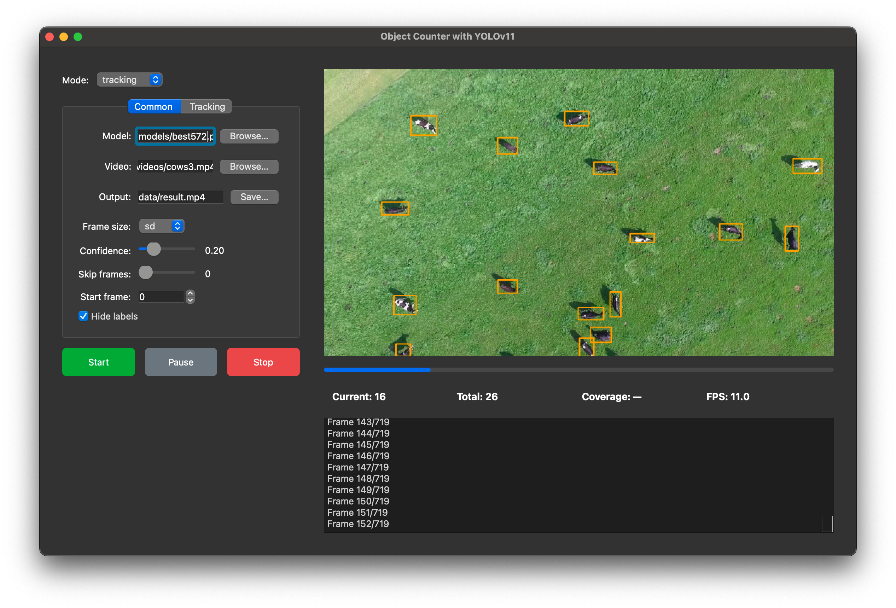
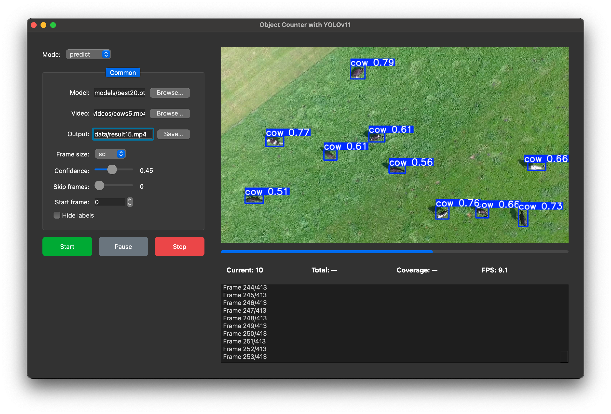
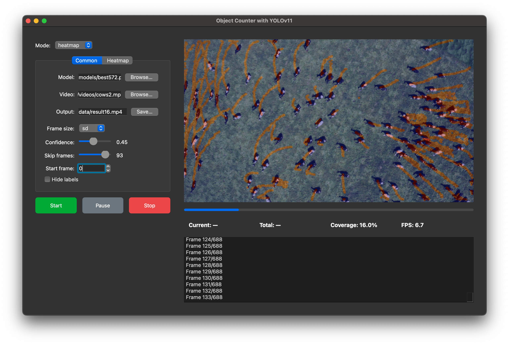

# YOLOv11: Обнаружение объектов, трекинг и тепловые карты



Этот проект представляет собой систему распознавания и отслеживания объектов на Python для обнаружения объектов, их отслеживания и построения тепловых карт с использованием модели [Ultralytics YOLOv11](https://github.com/ultralytics/ultralytics). Поддерживаются три основных режима:

* **Tracking** — отслеживание и подсчёт уникальных объектов между кадрами, рисование траекторий и вывод статистики.  
* **Predict** — классическое обнаружение объектов с ограничивающими рамками (подписи можно скрыть).  
* **Heatmap** — накопление детекций в тепловую карту, чтобы визуализировать плотность объектов во времени.

---

## Возможности

### Режимы обработки

#### Tracking


* Отслеживание и подсчёт уникальных объектов.
* Рисование траекторий заданной длины.
* Отображение текущего и суммарного количества.

#### Predict


* Базовое обнаружение с настраиваемыми рамками.
* Возможность скрыть подписи классов.
* Поддержка различных размеров изображений.

#### Heatmap


* Накопление всех детекций в одну тепловую карту.
* Настраиваемые прозрачность («alpha»), радиус точек и размытие.
* Подсчёт покрытия («coverage») поля кадра объектами.

### Гибкая настройка параметров

* Порог уверенности, размер изображения, пропуск кадров, стартовый кадр.
* Длина «хвоста» и толщина линий для трекинга.
* Параметры тепловой карты: alpha, радиус, размытие.

### CLI и GUI

* **CLI** для пакетной обработки.
* **PyQt5 GUI** для интерактивного управления параметрами, просмотра видео и логирования.

### Результаты

* Сохранение аннотированных кадров и сборка выходного видео.
* Опциональный вывод на экран в режиме реального времени.

---

## Структура репозитория

```
├── handler/
│   ├── base.py             # Абстрактный базовый класс c основным циклом
│   ├── config.py           # Парсер аргументов CLI
│   ├── constants.py        # Предопределённые размеры изображений
│   ├── predict.py          # Реализация режима Predict
│   ├── track.py            # Реализация режима Tracking
│   ├── heatmap.py          # Реализация режима Heatmap
│   └── custom_tracker.yaml # Настройки трекера ByteTrack
├── data/
│   ├── videos/             # Пример видео
│   └── results/            # Кадры для сборки видео
├── gui.py                  # Графический интерфейс PyQt5
├── main.py                 # Точка входа для CLI
├── requirements.txt        # Зависимости Python
└── README.md               # Документация (этот файл)
```

---

## Установка

1. **Клонируйте репозиторий**:

   ```bash
   git clone <URL-репозитория>
   cd <папка-репозитория>
   ```

2. **Создайте и активируйте виртуальное окружение** (рекомендуется):

   ```bash
   python3 -m venv venv
   source venv/bin/activate  # Windows: venv\Scripts\activate
   ```

3. **Установите зависимости**:

   ```bash
   pip install -r requirements.txt
   ```

4. **Скачайте или обучите модель YOLOv11** и поместите файл ``*.pt`` в папку `models/` (например, `models/best.pt`).

---

## Использование из командной строки

Запустите `main.py`, указав нужный режим и параметры:

```bash
python main.py <mode> [options]
```

### Режимы

* `tracking`
* `predict`
* `heatmap`

### Общие опции

| Опция               | Описание                                                  | По умолчанию            |
| ------------------- | --------------------------------------------------------- | ----------------------- |
| `-m, --model`       | Путь к модели YOLOv11 (`.pt`)                             | `models/best.pt`        |
| `-v, --video`       | Входной видео‑файл                                        | `data/videos/SAR.mp4`   |
| `-s, --save`        | Путь для сохранения выходного видео                       | `data/result.mp4`       |
| `-S, --show`        | Показывать кадры онлайн вместо сохранения изображений     | выкл.                   |
| `-c, --conf`        | Порог уверенности (0.0–1.0)                               | `0.01`                  |
| `--imgsz`           | Ключ размера изображения (`sd`, `s1K`, `s2K`, `s4K`)      | `s1K`                   |
| `--skip_frames`     | Пропускать кадры для ускорения обработки                  | `0`                     |
| `--start_frame`     | Начать обработку с указанного кадра                       | `0`                     |

### Опции трекинга (`tracking`)

| Опция              | Описание                                        | По умолчанию |
| ------------------ | ----------------------------------------------- | ------------ |
| `--draw_lines`     | Рисовать траектории                             | выкл.        |
| `--lines_history`  | Количество кадров в истории траектории          | `50`         |

### Опции тепловой карты (`heatmap`)

| Опция       | Описание                                    | По умолчанию |
| ----------- | ------------------------------------------- | ------------ |
| `--alpha`   | Прозрачность наложения (0.0–1.0)            | `0.4`        |
| `--radius`  | Радиус круга каждой детекции                | `15`         |
| `--blur`    | Применять ли Gaussian‑blur к тепловой карте | вкл.         |

---

## GUI

Скрипт `gui.py` запускает интерфейс на PyQt5:

```bash
python gui.py
```

В GUI можно:

* Выбрать режим (Tracking, Predict, Heatmap).
* Указать пути к модели, видео и файлу вывода.
* Настраивать параметры в реальном времени.
* Запускать, ставить на паузу и останавливать обработку.
* Смотреть видео, прогресс, статистику (кол‑во, покрытие, FPS) и логи.

---

## Кастомизация

* **Цвет и толщина рамок**: измените `HandlerBase.custom_box()` в `handler/base.py`.
* **Настройки трекера**: поправьте параметры в `models/custom_tracker.yaml`.
* **HUD‑элементы**: настройка через `counter_box`, `info_box` и метод `_draw_hud`.

---

## Лицензия

Проект распространяется под лицензией MIT. См. файл [LICENSE](LICENSE) для подробностей.
